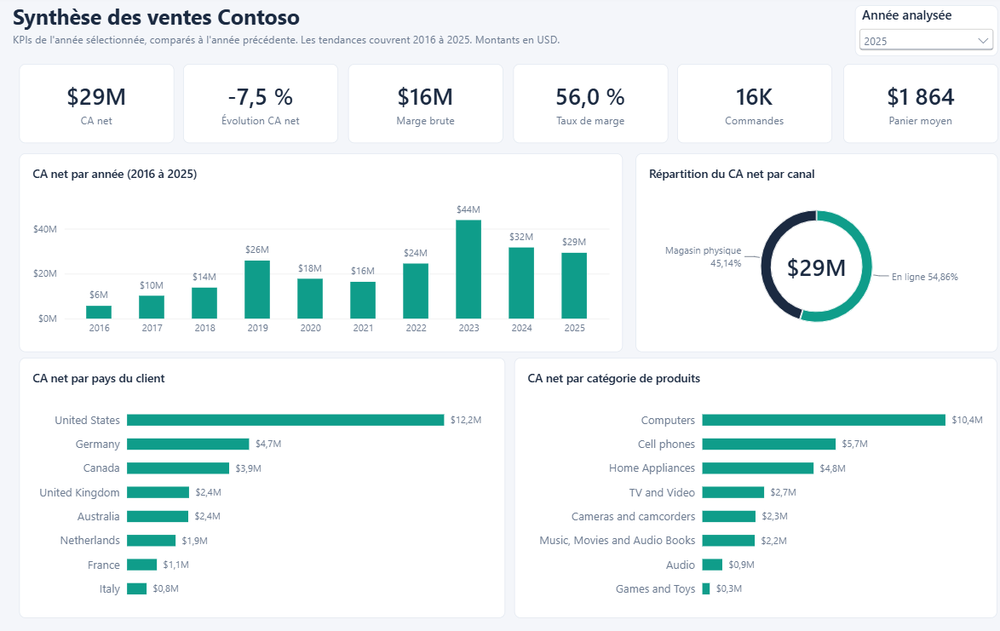
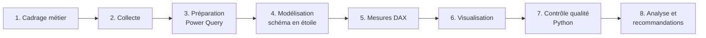
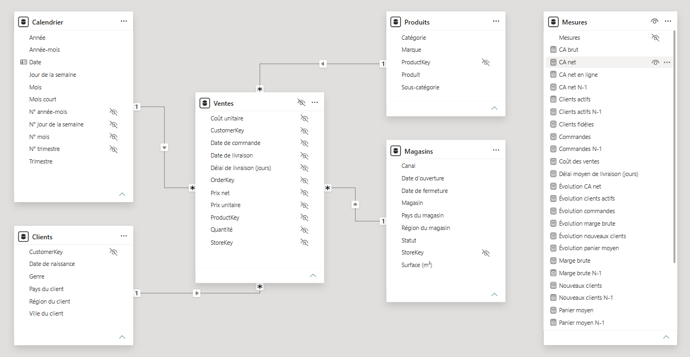
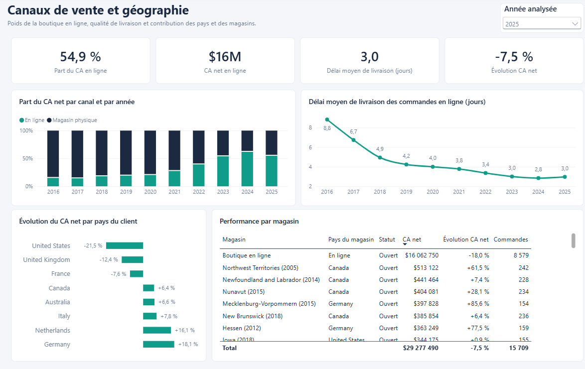
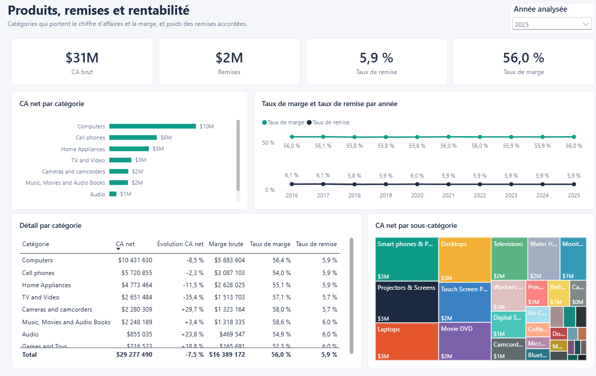
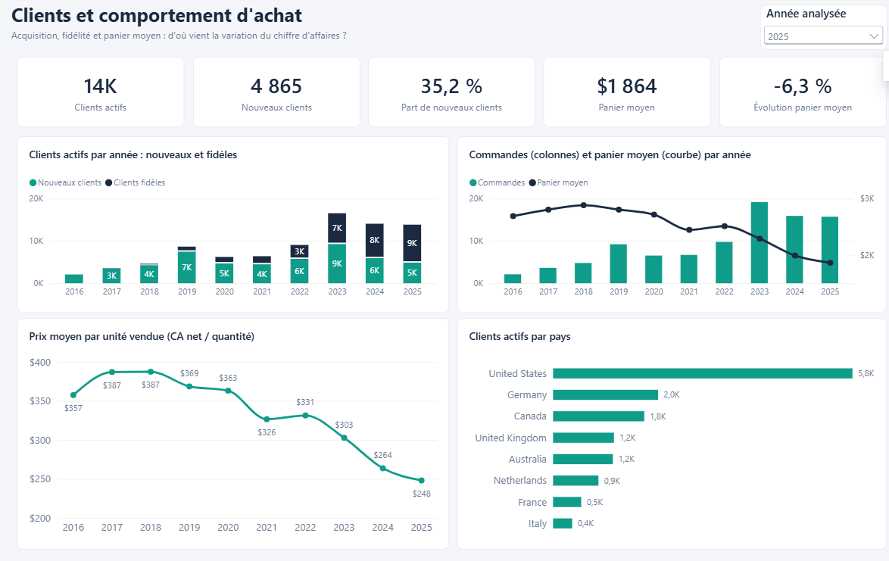

# Analyse des ventes Contoso avec Power BI


Projet d'analyse de données de bout en bout : à partir de fichiers CSV bruts, construction d'un rapport Power BI qui explique **pourquoi le chiffre d'affaires de Contoso a reculé de 33 % entre 2023 et 2025** et propose des pistes d'action.



---

## Sommaire

1. [Le projet en bref](#1-le-projet-en-bref)
2. [Les conclusions de l'analyse](#2-les-conclusions-de-lanalyse)
3. [Contexte et objectifs](#3-contexte-et-objectifs)
4. [Problématiques traitées](#4-problématiques-traitées)
5. [Données utilisées](#5-données-utilisées)
6. [Outils et technologies](#6-outils-et-technologies)
7. [Méthodologie](#7-méthodologie)
8. [Étapes de réalisation](#8-étapes-de-réalisation)
9. [Le rapport Power BI](#9-le-rapport-power-bi)
10. [Analyses et résultats détaillés](#10-analyses-et-résultats-détaillés)
11. [Recommandations](#11-recommandations)
12. [Principaux enseignements](#12-principaux-enseignements)
13. [Structure du projet](#13-structure-du-projet)
14. [Reproduire le projet](#14-reproduire-le-projet)
15. [Limites et pistes d'amélioration](#15-limites-et-pistes-damélioration)
16. [Crédits](#16-crédits)

---

## 1. Le projet en bref

> **En une phrase :** j'ai joué le rôle d'un Data Analyst chargé d'expliquer à une direction commerciale pourquoi ses ventes baissent, et de l'aider à décider quoi faire.

### La situation

Une entreprise de distribution voit son chiffre d'affaires reculer de 33 % en deux ans après une année record. La direction ne sait pas d'où vient la baisse : des magasins, du site internet, de certains pays, de certains produits, des clients ? Elle a besoin de réponses claires et d'un outil pour suivre la situation.

### Ce que j'ai fait

| Étape | En pratique |
|---|---|
| **Comprendre le besoin** | Identification des personnes concernées (direction, e-commerce, marketing, responsables produits) et formulation de 6 questions précises auxquelles l'analyse doit répondre |
| **Fiabiliser les données** | Contrôle de près de 225 000 lignes de ventes, détection et correction de pièges qui auraient faussé les chiffres sans alerte visible |
| **Construire un tableau de bord** | Un rapport de 4 pages, lisible en quelques minutes, qui va de la vue d'ensemble au détail par pays, produit et client |
| **Vérifier chaque résultat** | Recalcul indépendant de tous les indicateurs clés pour garantir que les chiffres présentés sont justes |
| **Conclure et recommander** | 6 constats appuyés sur des chiffres et 6 recommandations classées par priorité, avec l'indicateur qui permettra d'en suivre l'effet |
| **Documenter** | Cahier des charges, dictionnaire des données et présentation complète, pour qu'une autre personne puisse reprendre le travail |

### Ce que ce projet démontre

- **Sens métier** : partir d'un problème d'entreprise et d'utilisateurs réels, plutôt que de produire des graphiques pour eux-mêmes.
- **Rigueur** : les chiffres sont contrôlés deux fois, les hypothèses et les limites sont écrites noir sur blanc.
- **Esprit critique** : distinguer les vraies causes des fausses pistes (les remises, par exemple, ne sont pas responsables de la baisse).
- **Capacité de synthèse** : transformer des centaines de milliers de lignes en quelques messages clés compréhensibles par un public non technique.
- **Orientation décision** : chaque recommandation est reliée à un constat chiffré et à un indicateur de suivi.
- **Autonomie et organisation** : projet mené de bout en bout, du cadrage à la restitution, avec un historique de travail découpé par étapes.

### Pour découvrir le travail en 2 minutes

1. Lire [les conclusions de l'analyse](#2-les-conclusions-de-lanalyse) juste en dessous.
2. Parcourir [les captures du rapport](#9-le-rapport-power-bi).
3. Consulter [les recommandations](#11-recommandations).

## 2. Les conclusions de l'analyse

**Le constat.** Le chiffre d'affaires net est passé de **43,8 M$ en 2023 à 29,3 M$ en 2025 (-33 %)**. Pourtant, la **rentabilité n'a pas bougé** : la marge reste autour de 56 % et les remises autour de 6 % du chiffre d'affaires. Le problème ne vient donc ni des prix cassés ni des coûts, mais du **volume et de la valeur des ventes**.

**Les trois causes principales**

1. **Contoso recrute deux fois moins de nouveaux clients** : 9 257 en 2023, 4 865 en 2025 (-47 %). Les clients fidèles, eux, sont plus nombreux (+23 %), mais ne compensent pas.
2. **Les clients dépensent moins par commande** : le panier moyen recule de 19 % (2 289 $ à 1 864 $). Ils achètent autant d'articles, mais des **produits moins chers**.
3. **La baisse est très concentrée** : les **États-Unis** expliquent près de **80 %** de la perte de chiffre d'affaires, et les **ordinateurs** près de la **moitié**.

**Les signaux encourageants**

- La **fidélité progresse** : de plus en plus de clients reviennent acheter.
- L'**Allemagne (+18 %)**, les **Pays-Bas (+16 %)** et l'**Italie (+8 %)** repartent à la hausse en 2025.
- La **livraison en ligne** est rapide et stable (3 jours en moyenne, contre près de 9 en 2016) : elle n'est pas en cause.

**Les priorités recommandées**

1. Lancer un **diagnostic du marché américain**, qui concentre l'essentiel de la baisse.
2. **Relancer l'acquisition de nouveaux clients**, en priorité en ligne.
3. **Revaloriser le panier moyen** (offres groupées, accessoires, gammes supérieures).

Le détail chiffré se trouve dans les sections [Analyses et résultats détaillés](#10-analyses-et-résultats-détaillés) et [Recommandations](#11-recommandations).

## 3. Contexte et objectifs

**Contoso** est un distributeur (fictif) de produits électroniques et d'électroménager. Il vend dans des magasins physiques implantés dans 8 pays et via une boutique en ligne.

**Scénario.** En janvier 2026, à la clôture de l'exercice 2025, la Direction commerciale constate que le chiffre d'affaires a reculé deux années de suite après un record en 2023. En tant que Data Analyst, je dois lui fournir un rapport Power BI pour :

- **comprendre d'où vient ce recul** (canaux, pays, produits, clients) ;
- **vérifier que la rentabilité reste maîtrisée** ;
- **disposer d'un outil de pilotage** réutilisable pour suivre 2026.

Le cadrage complet (parties prenantes, KPIs, périmètre, hypothèses) est détaillé dans le [cahier des charges](docs/cahier-des-charges.md).

## 4. Problématiques traitées

| # | Question métier | Partie prenante |
|---|---|---|
| 1 | Comment le CA net et la marge ont-ils évolué de 2016 à 2025 ? | Direction commerciale |
| 2 | Quelle est la part de la boutique en ligne, et la livraison s'améliore-t-elle ? | Responsable e-commerce |
| 3 | Quels pays et quels magasins progressent ou reculent ? | Responsables pays et magasins |
| 4 | Quelles catégories portent le CA et la marge, et lesquelles expliquent le recul ? | Chefs de produit |
| 5 | Le recul vient-il du nombre de clients, du nombre de commandes ou du panier moyen ? | Marketing |
| 6 | Les remises pèsent-elles sur la rentabilité ? | Direction commerciale |

**Indicateur principal (North Star) : le CA net**, suivi avec le **taux de marge** comme garde-fou.

## 5. Données utilisées

| Élément | Détail |
|---|---|
| Source | [Contoso Data Generator V2](https://github.com/sql-bi/Contoso-Data-Generator-V2-Data) publié par **SQLBI** (licence MIT), jeu `csv-100k` |
| Période | du 18 mai 2016 au 31 décembre 2025 |
| Volume | 223 974 lignes de vente, 93 470 commandes, 52 189 clients acheteurs, 2 517 produits, 74 magasins |
| Devise | dollars US (USD) |
| Tables retenues | `sales` (faits), `product`, `store`, `customer` (dimensions) |

Le détail des colonnes conservées, écartées et transformées figure dans le [dictionnaire de données](docs/dictionnaire-de-donnees.md). Les fichiers bruts ne sont pas versionnés : voir [data/README.md](data/README.md) pour les télécharger.

## 6. Outils et technologies

| Outil | Utilisation dans le projet |
|---|---|
| **Power BI Desktop** | Environnement de développement du rapport |
| **Power Query (langage M)** | Import des CSV, typage, nettoyage, colonnes calculées, paramètre de chemin |
| **DAX** | Table Calendrier, 30 mesures (CA, marge, clients, évolutions N-1) |
| **Format PBIP (TMDL + PBIR)** | Projet enregistré en fichiers texte : modèle et mesures lisibles et versionnables dans Git |
| **Python (pandas)** | Contrôles qualité et recalcul indépendant des KPIs pour valider le rapport |
| **Git / GitHub** | Versionnage par étape sur une branche `dev` |
| **Markdown** | Cahier des charges, dictionnaire de données, README |

## 7. Méthodologie



Trois principes ont guidé le travail :

1. **Partir des questions métier**, pas des données : chaque graphique répond à une question du cahier des charges.
2. **Ne rien promettre que les données ne permettent pas** : le cadrage a été validé après exploration (absence de données de retours, de budget ou de trafic, par exemple).
3. **Vérifier chaque chiffre** : les KPIs du rapport sont recalculés indépendamment en Python avant d'être interprétés.

## 8. Étapes de réalisation

### 8.1 Préparation des données (Power Query)

- **Paramètre `CheminDonnees`** : toutes les requêtes lisent leurs fichiers à partir d'un seul paramètre, pour que le projet fonctionne sur n'importe quel poste.
- **Import fiable** : langue d'import réglée sur *Anglais (États-Unis)* (sinon `375.976` n'est pas reconnu comme un nombre) et encodage **UTF-8** (sinon `Café` devient `Café`).
- **Typage contrôlé** : codes postaux et références produit typés en **texte**. Typés en nombre, ils provoquaient 29 803 erreurs (codes canadiens, britanniques, néerlandais) et la perte silencieuse de 5 773 zéros initiaux.
- **Nettoyage** : conservation des seules colonnes utiles, suppression des données personnelles des clients (principe de minimisation), renommage en français, traduction des codes (`Closed` en `Fermé`, `male` en `Homme`).
- **Colonnes dérivées** : `Délai de livraison (jours)`, `Canal` (en ligne ou magasin physique) et un libellé `Magasin` unique (plusieurs magasins restructurés partageaient le même nom de région).

### 8.2 Modélisation (schéma en étoile)



- Une table de faits `Ventes`, quatre dimensions (`Calendrier`, `Produits`, `Magasins`, `Clients`) et une table `Mesures` dédiée.
- Relations **plusieurs-à-un** avec filtrage dans un seul sens, de la dimension vers les faits.
- **Table Calendrier créée en DAX** et marquée comme table de dates, avec des libellés en français. L'option « Date/heure automatique » est désactivée pour éviter les tables de dates cachées.
- Colonnes techniques (clés, prix unitaires) masquées : l'utilisateur ne manipule que des dimensions lisibles et des mesures.

### 8.3 Mesures DAX

30 mesures rangées en 5 dossiers. Quelques exemples :

```dax
CA net = SUMX ( Ventes, Ventes[Quantité] * Ventes[Prix net] )

Évolution CA net =
IF (
    HASONEVALUE ( Calendrier[Année] ),
    DIVIDE ( [CA net] - [CA net N-1], [CA net N-1] )
)

Nouveaux clients =
VAR DebutPeriode = MIN ( Calendrier[Date] )
VAR ClientsDeLaPeriode =
    ADDCOLUMNS (
        VALUES ( Ventes[CustomerKey] ),
        "@PremiereCommande",
            CALCULATE ( MIN ( Ventes[Date de commande] ), ALLEXCEPT ( Ventes, Ventes[CustomerKey] ) )
    )
RETURN
    COUNTROWS ( FILTER ( ClientsDeLaPeriode, [@PremiereCommande] >= DebutPeriode ) )
```

Le code complet est lisible directement dans [`Mesures.tmdl`](report/Contoso-Ventes.SemanticModel/definition/tables/Mesures.tmdl), grâce au format PBIP.

### 8.4 Conception du rapport

- 4 pages organisées du général au détail : **Synthèse**, **Canaux et pays**, **Produits et rentabilité**, **Clients**.
- Un filtre **Année analysée** synchronisé sur toutes les pages (2025 par défaut) pilote les KPIs, tandis que les **courbes de tendance ignorent ce filtre** et montrent toujours 2016 à 2025 (interactions entre visuels désactivées).
- Thème personnalisé (couleurs, cartes à coins arrondis, fond clair) pour une lecture homogène.

### 8.5 Contrôle qualité

Le script [`scripts/verifier_kpis.py`](scripts/verifier_kpis.py) vérifie l'intégrité des données (aucun doublon, aucune vente rattachée à un produit, magasin ou client inexistant, aucun prix net supérieur au prix unitaire) puis recalcule les KPIs par année. Les valeurs affichées dans Power BI (KPIs 2025, séries annuelles de commandes, de clients et de CA) ont été comparées à ce recalcul et concordent.

## 9. Le rapport Power BI

| Page | Contenu |
|---|---|
|  | **Synthèse** : KPIs de l'année, CA net par année, répartition par canal, CA par pays et par catégorie |
|  | **Canaux et pays** : part du CA en ligne, délai de livraison, évolution par pays, performance de chaque magasin |
|  | **Produits et rentabilité** : CA et marge par catégorie, taux de marge et de remise dans le temps, sous-catégories |
|  | **Clients** : nouveaux clients et clients fidèles, commandes et panier moyen, prix moyen par unité, clients par pays |

## 10. Analyses et résultats détaillés

### Vue d'ensemble (2016 à 2025)

| CA net | Marge brute | Taux de marge | Remises | Commandes | Clients | Panier moyen |
|---|---|---|---|---|---|---|
| 218,8 M$ | 122,3 M$ | 55,9 % | 13,8 M$ (5,9 %) | 93 470 | 52 189 | 2 341 $ |

| Année | CA net | Évolution | Commandes | Panier moyen | Nouveaux clients | Part en ligne | Délai en ligne |
|---|---|---|---|---|---|---|---|
| 2016* | 5,7 M$ | | 2 111 | 2 690 $ | 2 075 | 15,1 % | 8,8 j |
| 2017 | 10,2 M$ | +79,3 % | 3 632 | 2 804 $ | 3 434 | 14,3 % | 6,7 j |
| 2018 | 13,8 M$ | +35,4 % | 4 783 | 2 882 $ | 4 259 | 18,1 % | 4,9 j |
| 2019 | 25,8 M$ | +87,3 % | 9 208 | 2 804 $ | 7 456 | 19,3 % | 4,2 j |
| 2020 | 17,7 M$ | -31,3 % | 6 534 | 2 716 $ | 4 685 | 20,3 % | 4,0 j |
| 2021 | 16,4 M$ | -7,8 % | 6 693 | 2 445 $ | 4 472 | 27,5 % | 3,8 j |
| 2022 | 24,5 M$ | +49,7 % | 9 756 | 2 511 $ | 5 754 | 39,3 % | 3,4 j |
| **2023** | **43,8 M$** | **+78,9 %** | **19 145** | 2 289 $ | **9 257** | 53,9 % | 3,0 j |
| 2024 | 31,6 M$ | -27,8 % | 15 899 | 1 990 $ | 5 932 | 61,9 % | 2,8 j |
| 2025 | 29,3 M$ | -7,5 % | 15 709 | 1 864 $ | 4 865 | 54,9 % | 3,0 j |

<sub>* Année incomplète (ventes à partir du 18 mai 2016).</sub>

### Constat 1 : un recul de 33 % en deux ans, sans dégradation de la rentabilité

Après un record à **43,8 M$ en 2023**, le CA net chute à **31,6 M$ en 2024 (-27,8 %)** puis **29,3 M$ en 2025 (-7,5 %)**, soit **-14,6 M$** en deux ans.
Le **taux de marge reste stable autour de 56 %** et le **taux de remise autour de 5,9 %** chaque année depuis 2016. Le recul ne s'explique donc **ni par des remises plus fortes, ni par une érosion des marges** : c'est un problème de volume et de valeur des ventes.

### Constat 2 : moins de commandes et un panier moyen en forte baisse

Entre 2023 et 2025, le nombre de commandes baisse de **18 %** (19 145 à 15 709) et le panier moyen de **19 %** (2 289 $ à 1 864 $).
Le nombre d'articles par commande reste stable (environ 7,5), mais le **prix moyen par unité vendue passe de 303 $ à 248 $ (-18 %)**. Les clients achètent autant d'articles, mais des **produits moins chers** : c'est un effet de mix produit.

### Constat 3 : l'acquisition de nouveaux clients s'est effondrée

Les **nouveaux clients passent de 9 257 en 2023 à 4 865 en 2025 (-47 %)**, alors que les **clients fidèles progressent de 7 275 à 8 969 (+23 %)**. La part des nouveaux clients parmi les clients actifs tombe de 56 % à 35 %.
Contoso fidélise mieux, mais **ne recrute plus assez** pour compenser.

### Constat 4 : le marché américain explique près de 80 % du recul

Les clients américains représentent **51 % du CA** sur la période. Leur CA net passe de **23,6 M$ en 2023 à 12,2 M$ en 2025 (-48 %)**, soit **-11,4 M$ sur les -14,6 M$ de baisse totale**. Le Royaume-Uni recule aussi (-37 %).
À l'inverse, entre 2024 et 2025, l'**Allemagne (+18 %)**, les **Pays-Bas (+16 %)** et l'**Italie (+8 %)** repartent à la hausse. Côté magasins physiques, seuls **9 sur 57** progressent entre 2023 et 2025, et les plus fortes baisses concernent des magasins américains (Connecticut, Caroline du Sud, Montana : environ -58 %).

### Constat 5 : les ordinateurs et les téléviseurs concentrent la baisse des produits

Les **ordinateurs** pèsent 43 % du CA. Ils perdent **7,1 M$ entre 2023 et 2025 (-40 %)**, soit près de la moitié de la baisse totale. Les **TV et vidéo** chutent de 55 % et les **téléphones** de 29 %.
Les catégories **Audio (+17 %)** et **Jeux et jouets** sont stables ou en hausse, mais pèsent trop peu pour compenser.

### Constat 6 : la boutique en ligne est devenue le premier canal, et elle recule aussi

La part du CA réalisée en ligne passe de **15 % en 2016 à 62 % en 2024**, puis 55 % en 2025. Mais depuis 2023, **les deux canaux reculent** : -32 % en ligne, -35 % en magasin.
Le **délai moyen de livraison** des commandes en ligne est passé de **8,8 jours (2016) à 3,0 jours (2023)** et reste stable depuis : la baisse des ventes en ligne **n'est pas liée à une dégradation de la livraison**.

## 11. Recommandations

| Priorité | Recommandation | Constat | Indicateur de suivi |
|---|---|---|---|
| 1 | **Lancer un diagnostic du marché américain** (concurrence, prix, visibilité) et un plan d'action pour les magasins en plus forte baisse | 4 | CA net et évolution N-1 par pays et par magasin |
| 2 | **Relancer l'acquisition de clients**, en priorité en ligne et aux États-Unis (campagnes ciblées, offre de bienvenue) | 3 | Nouveaux clients, part de nouveaux clients |
| 3 | **Revaloriser le panier moyen** : ventes additionnelles (accessoires avec les ordinateurs), offres groupées, mise en avant des gammes supérieures | 2 | Panier moyen, prix moyen par unité |
| 4 | **Revoir l'offre Ordinateurs et TV** (assortiment, positionnement prix face à la concurrence) | 5 | CA net et évolution par catégorie |
| 5 | **Capitaliser sur la fidélité** avec un programme dédié, puisque la base de clients fidèles progresse | 3 | Clients fidèles |
| 6 | **Garder la discipline sur les remises** : tester des promotions ciblées plutôt que générales, et mesurer leur effet | 1 | Taux de remise, taux de marge |

Ces recommandations restent à confirmer avec des données absentes du jeu actuel (voir la section Limites).

## 12. Principaux enseignements

**Sur la démarche d'analyse**
- Le **cadrage métier** oriente tout le reste : une question précise produit un graphique utile.
- Une **recommandation doit reposer sur une donnée affichée**. Une analyse sans chiffre de livraison ne peut pas conclure sur la livraison.
- **Décomposer un indicateur** (CA = commandes × panier moyen, panier = articles × prix unitaire) permet de passer du constat à la cause.

**Sur la préparation des données**
- Les outils interprètent les données à notre place, et parfois se trompent : format décimal selon la langue, encodage des accents, codes typés en nombre, et même le code de province `NA` (Napoli) lu comme une valeur manquante par pandas.
- Une **valeur vide a souvent un sens métier** : un statut de magasin vide signifie « ouvert ».

**Sur Power BI**
- Le **schéma en étoile** et une **table Calendrier dédiée** sont la base de mesures fiables, notamment pour les comparaisons avec l'année précédente.
- **Colonne calculée ou mesure ?** Un calcul ligne par ligne qui ne dépend pas des filtres (délai de livraison) va dans Power Query ; un agrégat qui dépend des filtres (CA, panier moyen) devient une mesure DAX.
- Le **format PBIP** rend un projet Power BI lisible, vérifiable et versionnable comme du code.

## 13. Structure du projet

```
contoso-sales-powerbi/
├── README.md
├── LICENSE
├── data/
│   └── README.md                     Téléchargement des données (fichiers bruts non versionnés)
├── docs/
│   ├── cahier-des-charges.md         Cadrage : contexte, questions, KPIs, périmètre
│   ├── dictionnaire-de-donnees.md    Tables, colonnes, transformations, mesures
│   └── captures/                     Captures des pages et du modèle
├── report/
│   ├── Contoso-Ventes.pbip           Point d'entrée à ouvrir dans Power BI Desktop
│   ├── Contoso-Ventes.SemanticModel/ Modèle : requêtes M, tables, relations, mesures (TMDL)
│   └── Contoso-Ventes.Report/        Rapport : pages, visuels, thème (PBIR)
└── scripts/
    └── verifier_kpis.py              Contrôles qualité et recalcul des KPIs en Python
```

## 14. Reproduire le projet

**Prérequis :** Windows et [Power BI Desktop](https://aka.ms/pbidesktopstore) (gratuit).

1. Cloner le dépôt.
2. Télécharger `csv-100k.7z` depuis la [release SQLBI](https://github.com/sql-bi/Contoso-Data-Generator-V2-Data/releases/tag/ready-to-use-data) et l'extraire dans `data/raw/`.
3. Ouvrir `report/Contoso-Ventes.pbip` dans Power BI Desktop.
4. Dans **Accueil > Transformer les données > Modifier les paramètres**, renseigner `CheminDonnees` avec le chemin complet du dossier `data/raw/` (terminé par `\`).
5. Cliquer sur **Actualiser**.

**Contrôle optionnel des KPIs :**

```bash
pip install pandas
python scripts/verifier_kpis.py
```

## 15. Limites et pistes d'amélioration

**Limites**
- **Données fictives** générées par un outil : les constats illustrent une démarche, pas la situation d'une entreprise réelle.
- **Informations absentes** : retours produits, budget, coûts marketing, trafic en magasin et sur le site. Impossible de mesurer un taux de retour, un taux de conversion ou un écart aux objectifs.
- **Nouveaux clients** : l'historique commence en 2016, donc les clients des premières années sont presque tous comptés comme « nouveaux ». L'indicateur est surtout fiable à partir de 2019.
- **Analyse en USD** : les effets de change entre devises locales ne sont pas étudiés.
- **Libellés** : les noms de catégories et de pays sont conservés en anglais, tels qu'ils figurent dans le référentiel source.

**Pistes d'amélioration**
- Publier le rapport sur le **Power BI Service** avec actualisation planifiée.
- Ajouter une **sécurité au niveau des lignes (RLS)** pour que chaque responsable pays ne voie que son périmètre.
- Créer des **pages d'extraction (drill-through)** par magasin et par produit, et des **infobulles personnalisées**.
- Rendre les **titres dynamiques** selon l'année sélectionnée et proposer une **mise en page mobile**.
- Approfondir l'analyse client : **cohortes d'acquisition**, **segmentation RFM**, rétention.
- Intégrer un **budget 2026** et une **prévision** pour suivre les écarts.

## 16. Crédits

- Données : [SQLBI, Contoso Data Generator V2](https://github.com/sql-bi/Contoso-Data-Generator-V2-Data) (licence MIT).
- Licence du projet : [MIT](LICENSE).

**Auteur :** Dibie Elisee Jules Cedric KOUADIO ([@GomuGomuNo01](https://github.com/GomuGomuNo01))
